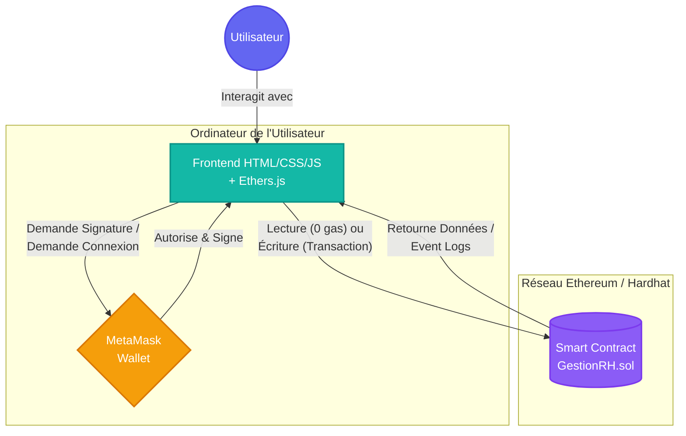
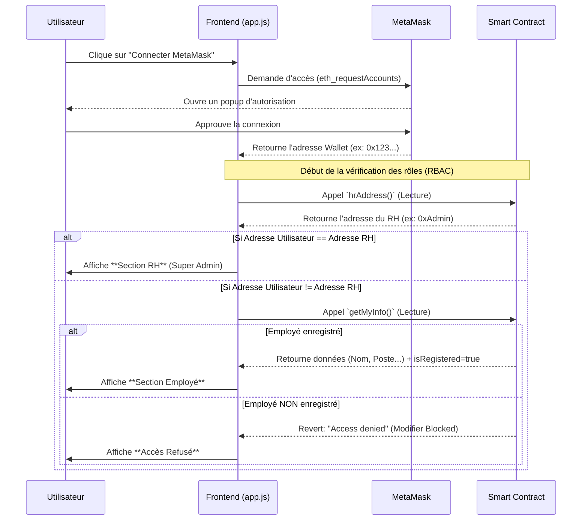
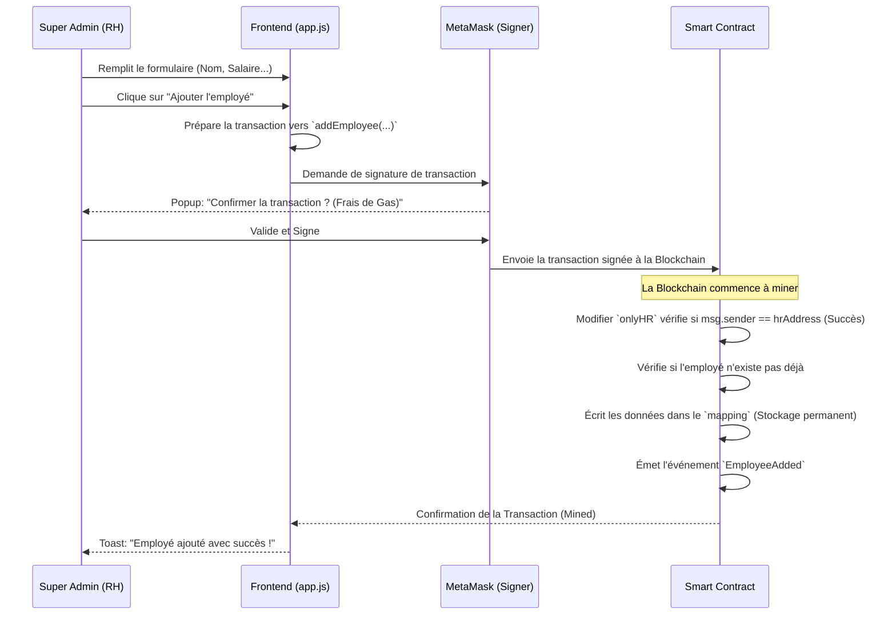
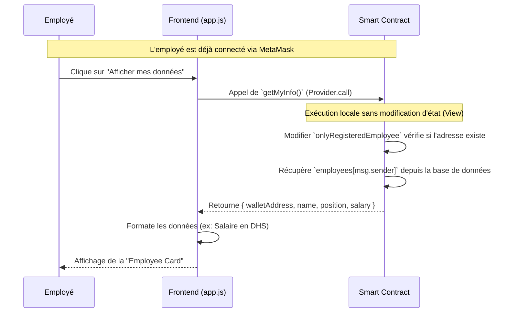

# 📊  Schémas d'Architecture et Workflows (BlockRH)

Ce document contient les diagrammes visuels de votre application. Ces schémas sont **parfaits pour votre présentation PowerPoint** car ils montrent exactement comment les données circulent entre l'utilisateur, le frontend (Navigateur), MetaMask et le backend (Smart Contract sur la Blockchain).

---

## 🏗️ 1. Architecture Globale (Web3)

Voici l'architecture technique de votre DApp. Contrairement à une application Web2 classique (où le Frontend parle à un serveur centralisé), ici le Frontend parle directement à la Blockchain via le Wallet.

---

## 👥 2. Scénario de Connexion & Routage (RBAC)

Que se passe-t-il exactement quand un utilisateur clique sur **"Connecter MetaMask"** ? Comment le Frontend sait-il quelle interface afficher ?

---

## ✍️ 3. Workflow du RH : Ajouter un Employé (Flux d'Écriture)

C'est l'action la plus critique du système. Elle modifie l'état de la blockchain, ce qui coûte du *Gas* et nécessite une *Signature Cryptographique*.

> **À retenir pour le jury :** Le frontend ne peut *jamais* ajouter d'employé tout seul. Si un hacker modifie le code JavaScript pour bypasser le frontend, la transaction échouera de toute façon sur la Blockchain car le Smart Contract validera mathématiquement (grâce à `onlyHR` et la signature MetaMask) que la transaction ne vient pas du vrai RH.

---

## 👁️ 4. Workflow de l'Employé : Consulter ses Données (Flux de Lecture)

Cette action est gratuite (0 Gas), rapide, et hautement confidentielle car l'employé ne peut lire que ses propres données.

> **Le secret de cette confidentialité :** La fonction `getMyInfo` ne prend aucun paramètre. Elle utilise `msg.sender` (l'adresse cryptographique de celui qui fait la requête). Il est donc physiquement impossible pour l'Employé A de demander les infos de l'Employé B, car A ne peut pas falsifier `msg.sender`.
